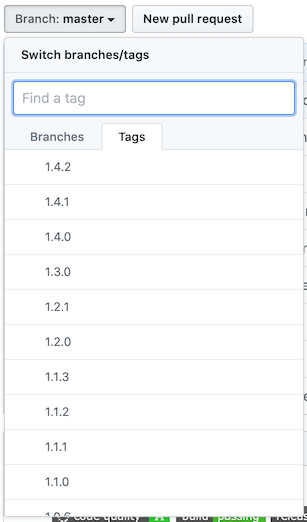

[](https://www.codacy.com/app/zim182/serenity-reportportal-integration?utm_source=github.com&amp;utm_medium=referral&amp;utm_content=Invictum/serenity-reportportal-integration&amp;utm_campaign=Badge_Grade)
[](https://travis-ci.org/Invictum/serenity-reportportal-integration)
[](https://github.com/Invictum/serenity-reportportal-integration/releases/latest)

Serenity integration with Report Portal
=======================================

Module allows to report Serenity powered tests to [reportportal.io](http://reportportal.io) server. Adds additional reporting to Serenity based test automation frameworks.

> **Warning**
>
> Make sure used integration version corresponds to documentation.

By default `development` branch documentation is selected and it may contains unreleased features description.

To view specific documentation version use tags switch at the top of github page as shown on image below



Table of Contents
-----------------
1. [Setup](#setup)
    1. [Maven](#maven)
    2. [Gradle](#gradle)
    3. [Snapshots](#snapshots)
    4. [Native Serenity reporting](#native-serenity-reporting)
2. [Integration configuration](#integration-configuration)
    1. [Presets](#presets)
    2. [Log units](#log-units)
    3. [Merge launches](#merge-launches)
    4. [Test retries](#test-retries)
    5. [Other settings](#other-settings)
3. [Data mapping](#data-mapping)
4. [Versioning](#versioning)
5. [Important release notes](#important-release-notes)
6. [Limitations](#limitations)

## Setup

To add support of integration between Serenity and Report Portal simply add dependencies to your project based on used build tool.

> **Warning**
>
> Don't add any extra Report Portal listeners or agents. Integration is provided by single module for all available Serenity approaches

#### Maven

Edit project's `pom.xml` file
```
<dependency>
   <groupId>com.github.invictum</groupId>
   <artifactId>serenity-reportportal-integration</artifactId>
   <version>1.5.7</version>
</dependency>
```

> **Warning**
> There is an issue with old version of `maven-failsafe-plugin` that causes wrong launch management on Report Portal. To avoid it you have to use plugin of version `2.19.1` or newer

#### Gradle

Edit your project `build.gradle` file
```
compile: 'com.github.invictum:serenity-reportportal-integration:1.5.7'
```

At this point setup of integration is done. The only thing you have to do is to configure Report Portal itself. In general it means just adding of `reportportal.properties` file to you project tests root. Minimal properties example is described below:
```
rp.endpoint = http://report-portal-url
rp.uuid = 385bha54-c1df-42c7-afa4-9e4c028930af
rp.launch = My_Cool_Launch
rp.project = My_Cool_Project
```
For more details related to Report Portal configuration please refer to [Report Portal Documentation](http://reportportal.io/docs/JVM-based-clients-configuration).

Now run tests normally and report should appear on Report Portal in accordance to configuration.

#### Snapshots

Sometimes it is necessary to use integration version that isn't released yet, but available in `develop` branch. Those builds available as snapshots and suffixed with `-SNAPSHOT` word.
To enable snapshots, extra configuration is required depending of build tool used.

> **Warning**
>
> Snapshots may have issues and are not intended to be used in production.

**Maven**

Add repository section to `pom.xml` as follows
```
<repository>
    <id>sonatype-snapshot</id>
    <url>http://oss.sonatype.org/content/repositories/snapshots/</url>
    <releases>
        <enabled>false</enabled>
    </releases>
    <snapshots>
        <enabled>true</enabled>
    </snapshots>
</repository>
```

Then define snapshot artifact version in dependencies
```
<dependency>
    <groupId>com.github.invictum</groupId>
    <artifactId>serenity-reportportal-integration</artifactId>
    <version>1.0.0-SNAPSHOT</version>
</dependency>
```

**Gradle**

Edit `build.gradle` file as follows
```
repositories {
    maven {
        url 'http://oss.sonatype.org/content/repositories/snapshots/'
    }
}
```

Add snapshots artifact in dependencies
```
compile: 'com.github.invictum:serenity-reportportal-integration:1.0.0-SNAPSHOT'
```

#### Native Serenity reporting

Serenity TAF may produce its own reporting via separate plugins. But `serenity-reportportal-integration` may be used in parallel with it or independently. Both reporting mechanisms should be configured independently and don't depends on each other.

## Integration configuration

Most of available configuration options are provided via `ReportIntegrationConfig` object:
```
ReportIntegrationConfig configuration = ReportIntegrationConfig.get();
configuration.usePreset(LogsPreset.FULL);
```

> **Notice**
>
> All integration configurations should be done before the start of Serenity facility. Otherwise default values will be used.

#### Presets

Each Serenity `TestStep` object is passed through chain of configured log units. Each particular log unit analyses step and creates a collection of records that will be send to RP. This approach allows to flexible configure reporting behaviour on a step level. By default integration provides a few log presets:

- DEFAULT
- FULL
- CUSTOM

`DEFAULT` preset is used by default and contains all usually required log units. It generates in Report Portal a nice log that does not cluttered with extra details.

`FULL` preset contains all available log units and generates full reporting. It suitable for demo purposes in order to choose a set of units.

To configure what should be logged manually `CUSTOM` preset is used. In following example `CUSTOM` preset with `Error.basic()` log unit is configured.
```
LogsPreset preset = LogsPreset.CUSTOM;
preset.register(Error.basic());
ReportIntegrationConfig.get().usePreset(preset);
```

#### Log units

All log units that are available out of the box may be observed in `com.github.invictum.reportportal.log.unit` package.
For now following units are available:
- `Error.basic()` extracts step's error if present. Includes regular errors as well as assertion fails. By default full stack trace will be reported.
- `Error.configuredError()` extract step's error using passed function in order to implement custom error logic message formatting.
```
LogsPreset preset = LogsPreset.CUSTOM;
// Extract only a short error description provided by Serenity
preset.register(Error.configuredError(TestStep::getConciseErrorMessage));
ReportIntegrationConfig.get().usePreset(preset);
```
- `Attachment.screenshots()` extracts screenshots if present. It simply retrieves all available step's screenshots, so screenshot strategy is configured on Serenity level.
- `Attachment.htmlSources()` extracts page source if available. Work in the same way as screenshots attachment.
- `Attachment.evidences()` logs evidences provided by Serenity. Attach each evidence as step attachment.
```
// Evidence with manually specified content
Serenity.recordReportData().asEvidence().withTitle("Title").andContents("My Content");
// Evidence from file
Serenity.recordReportData().asEvidence().withTitle("My Title").downloadable().fromFile(Paths.get("/Path/to/file"));
```
> **Notice**
>
> All evidences must be attached inside step method, otherwise they won't be send to RP.

- `Selenium.allLogs()` retrieves all logs supplied by Selenium. Suitable only for UI tests, when web driver supply some logs. Selenium logs works in conjunction with Selenium logs harvesting feature.
- `Selenium.filteredLogs(...)` retrieves logs supplied by Selenium, but filtered by passed predicate.
```
LogsPreset preset = LogsPreset.CUSTOM;
preset.register(Selenium.filteredLogs(log -> log.getType().contentEquals("browser")));
ReportIntegrationConfig.get().usePreset(preset);
// Enable Selenium logs harvesting
ReportIntegrationConfig.get().harvestSeleniumLogs(true);
```
- `Rest.restQuery()` records API call details, if they are present

It is possible to use integrated log units as well as custom implemented. To make own log unit just create a `Function<TestStep, Collection<SaveLogRQ>>`.
For example, let's implement log unit that generates greetings message for each started step
```
Function<TestStep, Collection<SaveLogRQ>> myUnit = step -> {
    Date startDate = Utils.stepStartDate(step);
    // Create an instance of SaveLogRQ that is able to hold a log message
    SaveLogRQ log = new SaveLogRQ();
    log.setMessage("Hello from started step " + step.getDescription());
    // Do not forget to set proper log level and timestamp
    log.setLogTime(startDate);
    log.setLevel(Utils.logLevel(step.getResult()));
    // Unit may produce several logs for future push to RP, but this example supply only one
    return Collections.singleton(log);
};

```

Now custom log unit could be added to configuration
```
LogsPreset preset = LogsPreset.CUSTOM;
preset.register(myUnit);
ReportIntegrationConfig.get().usePreset(preset);
```
 
> **Warning**
>
> To emit log to Report Portal proper time should be specified. If log timestamp is out of range of active test it won't be emitted at all. `TestStep` object contains all the data required to determinate start, end and duration

Provided collection of `SaveLogRQ` will be used to push logs to to Report Portal and their order will be based on timestamp.

#### Merge launches

By default separate launch will be created in RP for each module in case of multi-module project. This behavior can be changed with merge launches feature.

To understand a concept, let's assume following multi-module structure
```
my-project
.
+-- core    
+-- api
+-- ui
```

`core` is a module with some code that shared across `api` and `ui`. `ui` and `api` modules contain UI and API tests code. If tests will be run in a project root two launches will be produced - one for `ui` and another for `api`. 

To merge all launches that relates to submodules two options should be specified:
 - `serenity.rp.communication.dir` a path to a directory that will be used for sync
 Absolute paths are supported as well as relevant. So `/opt/sync` and `../sync` directories are valid. If supplied directory is absent it will be created automatically. Specified path must be writable.
 
 > **Caution**
 >
 > Don't specify existing directories with data, because at the end of execution mentioned directory will be removed with all files inside it
 
 > **Warning**
 >
 > If relevant path is specified target directory should be the same for all submodules, otherwise merge feature will fail
 - `serenity.rp.modules.count` total quantity of modules with tests
 Value should be positive integer more that 1. So minimal modules quantity to activate feature is 2
 
Both mentioned options are required before test mechanism start and must be specified as JVM arguments. For example for project described above
```
mvn clean verify -Dserenity.rp.communication.dir=../sync-dir -Dserenity.rp.modules.count=2
```

With merge feature activation each submodule still produce separate launch on execution phase, but they will be merged into one at the end of all tests execution.

#### Test retries

Report Portal has a feature to show [test retries](https://github.com/reportportal/documentation/blob/master/src/md/src/DevGuides/retries.md).
Serenity RP client will report all retries automatically if you are use maven with *failsafe/surefire* plugin, *junit4* and add `failsafe.rerunFailingTestsCount` or `surefire.rerunFailingTestsCount` property to your test execution.

> **Notice**
>
> Consider using RP rerun options if you don't use maven as a build tool. Check [documentation](https://github.com/reportportal/documentation/blob/master/src/md/src/DevGuides/rerun.md) for more details.

#### Other settings

Section includes minor settings that available to configure and describes their usage.

 Setting                 | Usage         | Description
-------------------------|---------------|----------------
Selenium logs harvesting |`ReportIntegrationConfig.get().harvestSeleniumLogs(true)` | Special option that works in conjunction with `Selenium.filteredLogs(...)` unit and must be enabled as well in order it to works. By default it is disabled.
Truncate names           |`ReportIntegrationConfig.get().truncateNames(true)`       | Allows to hide RP server errors that related to entities with long names (more that 1024 symbols) creation. It is not recommended to use it. By default it is disabled.

## Data mapping

Serenity framework and Report Portal facility have a different entities structure. This section explains how data relates to each other.

**Name** relation is straightforward.

 Serenity   | Report portal
------------|---------------
Test Class  | Suite
Test Method | Test
Scenario    | Test
Step        | Log entry

**Description** Each non-log entity in Report Portal may has a description. This field is populated from Serenity narrative section for both jUnit and BDD test sources.

For jBehave there is a special Narrative section in the story
```
Story example

Narrative:
Some simple example text

Scenario: Simple scenario
Given for simple scenario
When for simple scenario
Then for simple scenario
```

For jUnit there is a `@Narrative` annotation
```
@RunWith(SerenityRunner.class)
@Narrative(text = {"line 1", "line 2"})
public class SimpleTest {
    ...
}
```

By default each line of narrative is separated by a new line, so for example above following results is expected
```
line 1
line 2
```

It is possible to override default narrative formatter for jUnut style tests. For example let's use as narrative only the fist line of text.
```
// Define new mapping function
Function<Narrative, String> formatter = narrative -> narrative.text()[0];
// Set it in configuration before tests run
ReportIntegrationConfig.get().useClassNarrativeFormatter(formatter);
// Run you tests normally
```

In this example only the first line of narrative will be set to description. I. e. `line 1`. All the text that returned by formatter is treated as markdown, so markdown format is welcome.

**Tags** supplying depends on test source.
For jBehave (BDD) tests tags is defined in Meta section with `@tag` or `@tags` keyword
```
Story example

Meta:
@tags scope:smoke

Scenario: Simple scenario
Given for simple scenario
When for simple scenario
Then for simple scenario
```

For jUnit `@WithTagValuesOf` annotation is provided
```
@RunWith(SerenityRunner.class)
@WithTagValuesOf("scope:smoke")
public class SimpleTest {
    ...
}
```

## Versioning

Report Portal integration uses 3 digit version format - x.y.z

**z** - regular release increment version. Includes bugfix and extending with minor features. Also includes Serenity and Report Portal modules versions update. Backward compatibility is guaranteed.

**y** - minor version update. Includes major Serenity and Report portal core modules update. Backward compatibility for Serenity and Report Portal are not guaranteed.

**x** - major version update. Dramatically changed integration architecture. Backward compatibility doesn't guaranteed. Actually increment of major version is not expected at all

## Important release notes

Important release notes are described below. Use [releases](https://github.com/Invictum/serenity-reportportal-integration/releases) section for details regarding regular release notes.

 Version       | Note
---------------|---------------------------
1.0.0 - 1.0.6  | Supports RP v3 and below
1.1.0 - 1.1.3  | Minor version update due RP v4 release. Versions older than 1.1.0 are not compatible with RP v4+ and vise versa
1.2.0 - 1.2.1  | Minor version updated due internal mechanisms approach major refactoring
1.3.0          | Minor version updated due to log units approach rework
1.4.0 - 1.4.3  | Minor version update: removed tree handler, refactored to support DDT for BDD
1.5.0+         | Minor version update due RP v5 release

## Limitations

Integration does not support concurrency for parametrized Serenity tests execution.

Report Portal launch finish timestamp is calculated before Java VM shutdown. Overall launch duration will also include the time of Serenity report generation (only in case if both RP and Serenity reporting are used).
